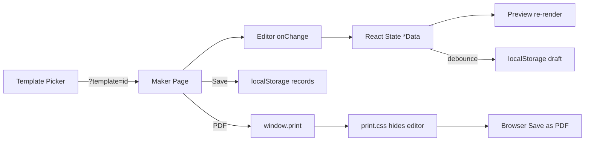

# Mahi Solar Document Suite — Project Implementation Guide

This document explains **how this entire project is built**, what technologies and patterns it uses, and **how to replicate it in another project** to create the same kinds of business documents.

> **All document makers output ISO 216 A4 pages (210 mm × 297 mm).**  
> The only exception is **Projects**, which uses a custom wide page for the spreadsheet table.

---

## A4 Document Standard (Required)

Every document maker in this app is built to produce **true A4 output**. When you replicate this project, keep these three layers in sync:

| Layer | Where | A4 rule |
|-------|--------|---------|
| **Screen preview** | `constants/sheet-layout.ts` | `PAGE_WIDTH = 794` px, `PAGE_HEIGHT = 1123` px (~96 dpi) |
| **Page components** | `*Preview.tsx` | Each page `div` uses `width: 794`, `height: 1123`, `data-export-page="true"` |
| **Print / PDF** | `src/styles/print.css` | `@page { size: A4; margin: 0; }` and each page `210mm × 297mm` |

### Canonical constants (`offer-letter/constants/sheet-layout.ts`)

```ts
export const PAGE_WIDTH  = 794;   // 210 mm at ~96 CSS dpi
export const PAGE_HEIGHT = 1123;  // 297 mm at ~96 CSS dpi
export const PAGE_WIDTH_MM  = 210;
export const PAGE_HEIGHT_MM = 297;
```

All other features **re-export** these from their own `constants/sheet-layout.ts` — do not duplicate different numbers.

### Which features are A4?

| Feature | A4? | Notes |
|---------|-----|-------|
| Offer Letters | ✅ Yes | Multi-page with letterhead on page 1 |
| Agreements | ✅ Yes | Multi-page, paginated clauses |
| Partner Agreements | ✅ Yes | Multi-page, paginated clauses |
| Quotations | ✅ Yes | Multi-page solar proposal |
| Company Profiles | ✅ Yes | Single A4 page (fixed height) |
| Employee Directory | ✅ Yes | Multi-page employee register |
| **Projects** | ❌ No | Wide landscape PDF sized to table width (spreadsheet export) |

### PDF workflow (A4 documents)

1. User clicks **PDF** → `window.print()`
2. `print.css` hides editor, toolbar, nav (`.no-print`)
3. Each `[data-export-page="true"]` block prints as one **210 × 297 mm** sheet
4. User chooses **Save as PDF** in the browser print dialog
5. In the print dialog, set **Paper size: A4** and **Margins: None** (or Default) for best match

### Checklist when adding a new A4 document

- [ ] Copy `sheet-layout.ts` constants (794 × 1123)
- [ ] Preview pages use `className="preview-a4-page"` and `data-export-page="true"`
- [ ] Add `#your-preview-id` rules to `print.css` (copy from offer-letter block)
- [ ] Maker page shows: *"Each page is 210 × 297 mm (A4)"*
- [ ] Do **not** use `minHeight` alone — use fixed `height` + `maxHeight` per page

---

## 1. What This App Does

A **single-page React application** for Mahi Solar Solution that lets users:

| Feature | Route | Output |
|---------|-------|--------|
| **Offer Letters** | `/offer-letters`, `/offer-letter` | Employment offer PDF (A4) |
| **Agreements** | `/agreements`, `/agreement` | Legal agreements PDF (A4) — 3 templates |
| **Partner Agreements** | `/partner-agreements`, `/partner-agreement` | MSE ↔ Partner deal PDF (A4) — 2 deal types |
| **Quotations** | `/quotations`, `/quotation` | Solar proposal / quotation PDF (A4) |
| **Company Profiles** | `/company-profiles`, `/company-profile` | Company details sheet PDF (A4) |
| **Employee Directory** | `/employees`, `/employee-directory` | Employee register PDF (A4) |
| **Projects** | `/projects` | Live merged Google Sheet register (**wide PDF**, not A4) |

Every document feature follows the same core idea:

1. **Editor** — form fields grouped in accordion sections
2. **Preview** — live A4 page layout that updates as you type
3. **Save** — store JSON in `localStorage` (no backend)
4. **PDF** — browser print dialog (`window.print()`), not a server PDF library

---

## 2. Technology Stack

### Runtime & build

| Tool | Version | Role |
|------|---------|------|
| **React** | 19.x | UI components |
| **React DOM** | 19.x | Rendering |
| **TypeScript** | 5.9 | Types across all features |
| **Vite** | 7.x | Dev server + production build |
| **@vitejs/plugin-react** | 5.x | JSX / Fast Refresh |
| **react-router-dom** | 7.x | Client-side routing |

### UI & styling

| Tool | Role |
|------|------|
| **Plain CSS** (no Tailwind in components) | `src/styles/*.css` — layout, cards, forms, print |
| **Tailwind CSS** | Listed in `package.json` but **not used** in component markup; styling is custom CSS |
| **lucide-react** | Icons (nav, toolbar, buttons) |
| **Lexend** font | Self-hosted variable font in `public/fonts/` (referenced from `base.css`) |

### What is NOT used

- No backend / API server
- No database
- No Redux / Zustand — local React state + `localStorage`
- No PDF library (jsPDF, Puppeteer, etc.) — **print CSS only**
- No axios / fetch for documents (except Google Sheets on Projects page)
- No UI component library (MUI, shadcn, etc.)

### Path alias

```ts
// vite.config.ts + tsconfig.json
"@/*" → "src/*"
```

---

## 3. Repository Structure

```
OFFERLETTER/
├── index.html                 # SPA entry
├── package.json
├── vite.config.ts
├── tsconfig.json
├── public/
│   └── assets/                # Company logos (mss-logo.png, mse-logo.png)
├── src/
│   ├── main.tsx               # React bootstrap, router, seed data
│   ├── App.tsx                # Routes + conditional nav
│   ├── components/            # Shared UI (nav, maker toolbar)
│   ├── styles/                # Global CSS (base, layout, components, print)
│   └── features/              # One folder per document type
│       ├── offer-letter/
│       ├── agreement/
│       ├── partner-agreement/
│       ├── quotation/
│       ├── company-profile/
│       ├── employee-directory/
│       └── mss-sites/         # Projects (Google Sheets)
```

### Standard feature folder layout

Each document feature follows this pattern:

```
features/<name>/
├── index.ts                   # Public exports (pages)
├── types/<name>.ts            # TypeScript interfaces for document data + record
├── constants/
│   └── sheet-layout.ts        # A4 dimensions (794×1123 px) — shared by preview + print
├── lib/
│   ├── <name>-defaults.ts     # Default content, templates, createDefault*()
│   ├── <name>-storage.ts      # localStorage CRUD + draft
│   ├── <name>-formatters.ts   # Dates, currency, placeholders
│   └── <name>-parser.tsx      # Optional rich-text / bullet rendering
├── components/
│   ├── <Name>Editor.tsx       # Form UI (accordion sections)
│   ├── <Name>Preview.tsx      # A4 paginated preview
│   └── Save<Name>Dialog.tsx   # Save modal
└── pages/
    ├── All<Name>s.tsx         # Template picker + saved list
    └── <Name>Maker.tsx        # Editor + preview shell
```

---

## 4. Application Architecture

### 4.1 Routing (`App.tsx`)

```
/                          → redirect to /offer-letters
/offer-letters             → list + template picker
/offer-letter              → new (needs ?template= or draft)
/offer-letter/:id          → edit saved record

/agreements, /agreement, /agreement/:id
/partner-agreements, /partner-agreement, /partner-agreement/:id
/quotations, /quotation, /quotation/:id
/company-profiles, /company-profile, /company-profile/:id
/employees, /employee-directory, /employee-directory/:id
/projects                  → MSS sites table (was /mss-sites)
```

**Maker routes** hide the top `FeatureNavigation` and show `MakerStickyTopbar` instead (detected by pathname in `App.tsx`).

### 4.2 Navigation

| Component | When shown | Purpose |
|-----------|------------|---------|
| `FeatureNavigation` | List pages (`/offer-letters`, etc.) | Sticky top nav between features |
| `MakerFeatureNav` | Inside maker toolbar | Switch document type while editing |
| `MakerStickyTopbar` | Maker pages | Back, Split/Editor/Preview, Reset, PDF, Save |

### 4.3 Maker page pattern (all documents)

Every `*Maker.tsx` page implements the same lifecycle:

```
1. Resolve initial data:
   - Saved record by :id  → load from localStorage
   - ?template=xyz          → createDefault*Data(template)
   - Draft in localStorage  → restore unsaved work
   - Else                   → redirect to list page

2. State:
   - data: DocumentData
   - viewMode: "split" | "editor" | "preview"
   - isDirty: JSON.stringify(data) !== savedSnapshot

3. Auto-save draft (debounced 400ms) while editing new docs

4. useBeforeUnload → warn on tab close if dirty

5. Layout:
   - Editor panel (class: editor-shell no-print)
   - Preview panel (class: preview-shell, stays in DOM for print)

6. handleSaveAsPdf():
   - await document.fonts.ready
   - short delay (150ms)
   - window.print()

7. handleSave(name):
   - save*Record({ id, name, content })
   - clearDraft()
   - navigate to /feature/:id
```

### 4.4 Persistence (`localStorage`)

Each feature has its own storage module with the same API shape:

```ts
const RECORDS_KEY = "<feature>-records";
const DRAFT_KEY   = "<feature>-draft";

list*()              // all saved, sorted by updatedAt desc
get*(id)             // one record
save*Record({ id?, name, content })  // create or update
delete*Record(id)
saveDraft(content)   // auto-save while creating new doc
getDraft() / clearDraft()
```

Record shape:

```ts
interface *Record {
  id: string;           // crypto.randomUUID()
  name: string;         // user-facing label
  content: *Data;       // full document JSON
  createdAt: string;    // ISO date
  updatedAt: string;
}
```

**No server sync.** To add a backend later, replace storage functions with API calls; keep the same `*Data` types.

### 4.5 Template system

Templates are **not separate files** — they are:

1. A union type (`OfferLetterTemplate`, `AgreementTemplate`, etc.)
2. A constant array with `id`, `label`, `description` for the picker UI
3. A `createDefault*Data(template)` factory that returns pre-filled JSON

Example flow:

```
User clicks "Fresh Employment" card
  → navigates to /offer-letter?template=fresh
  → OfferLetterMaker calls createDefaultOfferLetterData("fresh")
  → Editor + Preview render from that JSON
```

---

## 5. Preview & PDF System (Core Pattern)

This is the most important part to replicate.

### 5.1 A4 page constants (single source of truth)

**File:** `src/features/offer-letter/constants/sheet-layout.ts`

All document features import from here. Never hardcode different pixel sizes.

```ts
// Screen (CSS pixels at ~96 dpi)
PAGE_WIDTH  = 794   // = 210 mm
PAGE_HEIGHT = 1123  // = 297 mm

// Print (millimetres — referenced in print.css)
PAGE_WIDTH_MM  = 210
PAGE_HEIGHT_MM = 297
```

Padding and pagination capacity:

```ts
PAGE_SIDE_PADDING = 56
PAGE_TOP_BOTTOM_PADDING = 40
HEADER_HEIGHT = 150              // first-page letterhead only
FIRST_PAGE_CAPACITY = 1123 - 150 - 80   // less room on page 1
FOLLOWING_PAGE_CAPACITY = 1123 - 80     // full body on page 2+
```

### 5.2 Block-based pagination

Preview components build an array of **blocks**:

```ts
interface PreviewBlock {
  key: string;
  estimate: number;      // guessed height in px
  node: ReactNode;       // actual rendered content
  keepWithNext?: boolean; // avoid orphan headings
}
```

Algorithm (`paginateBlocks`):

1. Measure real heights in a hidden off-screen layer (`useLayoutEffect`)
2. Walk blocks; accumulate height per page
3. When a block doesn't fit, start new page
4. `keepWithNext` pulls previous block onto next page (e.g. heading + first paragraph)
5. First page uses smaller capacity (letterhead takes space)

Rendered output:

```tsx
<div id="offer-letter-preview" className="preview-a4-viewport">
  {pages.map((pageBlocks, pageIndex) => (
    <Page key={pageIndex} pageIndex={pageIndex}>
      {pageBlocks.map(block => block.node)}
    </Page>
  ))}
</div>
```

Each `Page` is a fixed `794×1123` white box with optional letterhead on page 0.

### 5.3 Print CSS (`src/styles/print.css`) — forces A4 output

```css
@page {
  size: A4;      /* ISO 216 — 210 mm × 297 mm */
  margin: 0;
}

@media print {
  .no-print { display: none !important; }

  /* Preview container */
  #offer-letter-preview,
  #agreement-preview,
  /* ... all document preview IDs ... */ {
    width: 210mm !important;
  }

  /* Each page sheet */
  [data-export-page="true"] {
    width: 210mm !important;
    height: 297mm !important;
    max-height: 297mm !important;
    page-break-after: always;
    overflow: hidden !important;
  }

  /* Last page — no trailing blank sheet */
  [data-export-page="true"]:last-child {
    page-break-after: auto;
  }
}
```

**PDF = Print to PDF** in Chrome/Edge with paper size **A4**. No server PDF library.

> **Projects exception:** Uses `@page mss-sites-page { size: {dynamic}mm 297mm }` — wide landscape, not standard A4.

### 5.4 Inline styles in preview

Preview components use **inline `CSSProperties`** for document content (fonts, margins, colors). This keeps print output independent of app chrome CSS.

Shared document colors:

- Primary blue: `#14306b` / `#152036`
- Body text: `#111827`
- Borders: `#e5e7eb`

### 5.5 Rich text in terms/clauses

`offer-letter-parser.tsx` parses plain text with:

- `- bullet lines` → `<ul><li>`
- Nested bullets (indented `-`)
- Blank lines → spacing

Used for offer letter terms and similar free-text fields.

### 5.6 Agreement placeholder engine

Agreements use `{{placeholder}}` syntax in clause text:

```
{{company.name}}
{{party.entityName}}
{{var.scheme}}
{{effectiveDateFormatted}}
{{vendorChargePerWatt}}
```

`fillTemplate(input, data)` in `agreement-formatters.ts` replaces placeholders at render time. Empty values show `___________`.

---

## 6. Shared Components

| Component | Location | Used by |
|-----------|----------|---------|
| `FeatureNavigation` | `src/components/` | List pages |
| `MakerStickyTopbar` | `src/components/` | All maker pages |
| `MakerFeatureNav` | `src/components/` | Toolbar document switcher |
| `ImageUploader` | `offer-letter/components/` | Logo, seal, signature (base64 data URLs) |
| `PartyEditor` | `agreement/components/` | Agreement + Partner counterparty fields |
| `ClauseListEditor` | `agreement/components/` | Drag/reorder clauses + sub-points |
| `AccordionSection` | Defined locally in each Editor | Collapsible form sections |

### Image upload pattern

Files are read with `FileReader.readAsDataURL()` and stored as **base64 strings** inside the JSON document. No file server.

---

## 7. Feature-by-Feature Breakdown

### 7.1 Offer Letters

**Templates:** `fresh` | `full-time-conversion` | `direct-full-time`

| Template | Difference |
|----------|------------|
| Fresh | Includes probation period clause |
| Full-time conversion | Salary review clause, no probation |
| Direct full-time | Same as conversion |

**Data model highlights:** `OfferLetterData`

- `company` — letterhead (name, logo, address, CIN, GST)
- Employee fields — name, address, role, DOJ, salary
- `roleOverview` + `responsibilityPoints[]`
- `leavePolicy[]`, `otherBenefits[]`
- `terms[]` — `{ id, title, content }` with rich-text bullets
- Toggles — `showAcceptance`, `showSeal`, `showSignature`, `showPageNumbers`

**Preview sections:** Letterhead → OFFER LETTER title → employee block → role/responsibilities → policies → terms → acceptance + signatures

---

### 7.2 Agreements (3 templates)

**Templates:**

| ID | Label |
|----|-------|
| `partnership` | Vendor Code Authorisation Agreement |
| `inc-installation-assign` | INC Project — Installation Assignment |
| `inc-goodwill-execution` | INC Project — Goodwill Execution Letter |

**Data model:** `AgreementData`

- `template`, `language` (`en` | `hi` — Hindi only for `partnership`)
- `company`, `party` (counterparty)
- `variableFields[]` + `variables` record (scheme, region, DISCOM, etc.)
- `introTemplate`, `recitals[]`, `preambleAfterRecitals`
- `sections[]` → `clauses[]` → `subPoints[]`
- `closingParagraph`, `governingLawParagraph`
- `witnesses[]`, vendor charge toggle, letterhead toggle

**Special:** `switchAgreementLanguage()` swaps all template text while preserving user-filled fields.

**Preview:** Numbered clauses, signature blocks (company left, party right), optional witnesses, page numbers.

---

### 7.3 Partner Agreements (2 deal types)

**Deal types:** `fixed-rate` | `profit-share`

Reuses agreement types (`AgreementCompany`, `AgreementSection`, `AgreementClause`) via type aliases.

**Extra fields vs regular agreement:**

- `dealHeading`, `dealIntro`, `rateCards[]` (capacity, phase, price)
- `rateNote`
- Payment flow clauses (loan / cash / cash+loan — Clause 4)

**Company defaults:** Uses **Mahi Solar Energy** branding (not MSS Pvt Ltd).

---

### 7.4 Quotations

**Data model:** `QuotationData`

- Customer + capacity + proposal date
- `coverImageUrl`, `tagline`
- `materialItems[]` — BOM table (description, qty, unit, make)
- `installationWork[]`, `assumptions[]`, `customerScope[]`
- `commercialOffer[]` — parameter/offering rows
- `generation` — per day/month/year savings
- Warranty badges, installation steps diagram
- Subsidy amount, net metering note, load extension note
- `terms[]`, `subsidyDocuments[]`, bank details, rep contact

**Preview:** Multi-section solar proposal with tables, bullet lists, optional generation/warranty sections.

---

### 7.5 Company Profiles

**Firms:** `mahi-solar-solution` | `mahi-solar-energy`

**Data model:** `CompanyProfileData`

- Branding — logo, legal name, tagline
- Contact — address, phones, email, website
- Statutory — GST, PAN, CIN
- Bank details
- Contact person
- Per-section print toggles (`showContact`, `showStatutory`, etc.)

---

### 7.6 Employee Directory

**Data model:** `EmployeeDirectoryData`

- Company header
- `employees[]` — each with personal, statutory (Aadhaar, PAN), bank details
- Renders as a register/table-style PDF

**Seed data:** `main.tsx` calls `seedEmployeeDirectory()` to pre-load MSE employee sample on first run.

---

### 7.7 Projects (MSS Sites — Google Sheets)

**Different from other features:** read-only live data, not localStorage documents.

**Spreadsheets and tab rules** (source of truth: `src/features/mss-sites/lib/projects-config.ts`):

| Source | Spreadsheet ID | What to load |
|--------|----------------|--------------|
| **MSS site register** | `1fe4vitjQwMhw92QltKECwBylbJ8ORWK3TsaI6548SEg` | All tabs from **MSS res** through **DHERAJ JI SITES** (11 data tabs). **Exclude** the summary tab and **ALWAR SITES** (and anything after it). |
| **DEC to FEB (Arkshakti)** | `1tkNFHBLjpOZkzayqObWO1VMYkGsD5uy-wrXaBcqHglE` | **First 6 tabs only** (see list below). Tabs after Pradeep (veer) are not loaded. |

**MSS workbook — all 13 tabs (live audit):**

| # | Tab | Total rows | Filled rows | With client name | Loaded in app? |
|---|-----|------------|-------------|------------------|----------------|
| 1 | summary | 10 | 10 | 0 | No (dashboard) |
| 2 | MSS res | 44 | 44 | 34 | Yes |
| 3 | SHRIPAL JI | 21 | 21 | 20 | Yes |
| 4 | Rohit (RJ GREEN) | 8 | 8 | 8 | Yes |
| 5 | SATAYNARAYAN JI | 20 | 20 | 20 | Yes |
| 6 | Ajay (everest) | 17 | 17 | 16 | Yes |
| 7 | RAVI JI SITES | 3 | 3 | 3 | Yes |
| 8 | JITENDRA JI | 5 | 5 | 1 | Yes |
| 9 | **KAVITA MAM** | 7 | 7 | 7 | Yes |
| 10 | SUNNY JI | 2 | 2 | 2 | Yes |
| 11 | ROHIT JI PHULERA | 1 | 1 | 1 | Yes |
| 12 | DHERAJ JI SITES | 1 | 1 | 1 | Yes |
| 13 | ALWAR SITES | 30 | 30 | 22 | No |

Tab 9 is spelled **KAVITA MAM** (not KAVITA MAAM). A wrong name makes Google gviz silently return `MSS res` data instead of erroring.

**MSS tabs loaded in app (11 tabs, 113 rows with client name):**

1. MSS res  
2. SHRIPAL JI  
3. Rohit (RJ GREEN)  
4. SATAYNARAYAN JI  
5. Ajay (everest)  
6. RAVI JI SITES  
7. JITENDRA JI  
8. KAVITA MAM  
9. SUNNY JI  
10. ROHIT JI PHULERA  
11. DHERAJ JI SITES  

**DEC to FEB tabs loaded (first 6 only):**

1. MSS res  
2. SHRIPAL JI  
3. MSS COMMERCIAL  
4. Ajay (everest)  
5. Rohit (RJ GREEN)  
6. Pradeep (veer)  

**Not loaded:** MSS summary tab, MSS ALWAR SITES; Arkshakti RAVI, ARKSHKATI COMM, ALWAR SITES, and any later tabs.

**Fetch pipeline:**

```
projects-config.ts     → spreadsheet IDs, tab lists, gviz URL builder
parse-gviz-sheet.ts    → fetch + parse Google Visualization API JSON
projects-columns.ts    → canonical headers, row mapping, filters
dedupe-project-rows.ts → dedupe exact row repeats (PROJECT TYPE + VENDOR + NAME + KW + LOCATION + K.NO)
fetch-mss-sites.ts     → merge configured tabs, assign vendor (MSS / Arkshakti)
MssSitesTablePreview   → filters + sticky header table
prepare-mss-sites-print.ts → dynamic wide @page size for PDF
```

**Google Sheets URL format:**

```
https://docs.google.com/spreadsheets/d/{ID}/gviz/tq?tqx=out:json&sheet={name}&headers=1
```

Sheet must be **published / accessible** for client-side fetch to work.

**Table features:**

- Filters — Vendor, Project Type, Work Status, Client name search
- Sticky column headers on page scroll
- MORE column — portal tooltip with hidden fields (K.NO, GPS, etc.)
- Totals row for numeric columns
- PDF toggle for MORE column

---

## 8. Styling System

CSS files imported in order from `src/styles/index.css`:

| File | Purpose |
|------|---------|
| `base.css` | Font, reset, body gradient |
| `layout.css` | Nav, page shell, cards, grids |
| `components.css` | Forms, accordions, maker toolbar, MSS table |
| `responsive.css` | Mobile breakpoints |
| `print.css` | All print/PDF rules |

### Key CSS classes

| Class | Purpose |
|-------|---------|
| `page-shell` | Centered content container |
| `page-shell--maker` | Full-width editor layout (40/60 split) |
| `content-card` | Glass-style white card |
| `layout-grid` | Editor + preview columns |
| `preview-a4-page` | Fixed A4 page box |
| `preview-a4-viewport` | Scrollable preview container |
| `no-print` | Hidden when printing |
| `sticky-topbar` | Maker toolbar |
| `accordion-trigger` | Collapsible editor sections |

---

## 9. How to Replicate in Another Project

### Step 1 — Scaffold

```bash
npm create vite@latest my-doc-app -- --template react-ts
cd my-doc-app
npm install react-router-dom lucide-react
```

Add path alias in `vite.config.ts` and `tsconfig.json` (copy from this repo).

### Step 2 — Copy styling foundation

Copy `src/styles/` entirely. Add Lexend font to `public/fonts/`. Import `./styles/index.css` in `main.tsx`.

### Step 3 — Add shared shell

Copy:

- `src/components/FeatureNavigation.tsx`
- `src/components/MakerFeatureNav.tsx`
- `src/components/MakerStickyTopbar.tsx`
- `src/App.tsx` routing pattern

### Step 4 — Add one document feature (template)

For each new document type:

1. **Define types** — `*Data` and `*Record` interfaces
2. **Write defaults** — `createDefault*Data()`, template list, pre-filled legal/business text
3. **Write storage** — copy `offer-letter-storage.ts`, rename keys
4. **Build Editor** — accordion sections, controlled inputs, `onChange` updates parent state
5. **Build Preview** — blocks array → measure layer → `paginateBlocks` → `Page` components
6. **Add `sheet-layout.ts`** — copy A4 constants
7. **Build Maker page** — copy `OfferLetterMaker.tsx` pattern
8. **Build All page** — template grid + saved cards
9. **Register routes** in `App.tsx`
10. **Add print rules** in `print.css` for `#your-preview-id`

### Step 5 — PDF

No extra library. Use:

```ts
async function handleSaveAsPdf() {
  await document.fonts.ready;
  await new Promise(r => setTimeout(r, 150));
  window.print();
}
```

Mark editor/toolbar with `className="no-print"`.

### Step 6 — Optional: Google Sheets feature

Copy `src/features/mss-sites/` if you need live spreadsheet tables. Requires:

- Public or link-shared Google Sheet
- Exact tab names in config
- CORS-friendly gviz endpoint

---

## 10. Data Flow Diagrams

### Document maker flow



### Agreement placeholder flow

```mermaid
flowchart TD
  A[Clause text with {{company.name}}] --> B[fillTemplate]
  B --> C[buildPlaceholderScope]
  C --> D[Replace {{path}} tokens]
  D --> E[Rendered in Preview]
```

---

## 11. Routes Reference

| Path | Component |
|------|-----------|
| `/offer-letters` | `AllOfferLetters` |
| `/offer-letter` | `OfferLetterMaker` |
| `/offer-letter/:id` | `OfferLetterMaker` |
| `/agreements` | `AllAgreements` |
| `/agreement` | `AgreementMaker` |
| `/agreement/:id` | `AgreementMaker` |
| `/partner-agreements` | `AllPartnerAgreements` |
| `/partner-agreement` | `PartnerAgreementMaker` |
| `/partner-agreement/:id` | `PartnerAgreementMaker` |
| `/quotations` | `AllQuotations` |
| `/quotation` | `QuotationMaker` |
| `/quotation/:id` | `QuotationMaker` |
| `/company-profiles` | `AllCompanyProfiles` |
| `/company-profile` | `CompanyProfileMaker` |
| `/company-profile/:id` | `CompanyProfileMaker` |
| `/employees` | `AllEmployeeDirectories` |
| `/employee-directory` | `EmployeeDirectoryMaker` |
| `/employee-directory/:id` | `EmployeeDirectoryMaker` |
| `/projects` | `MssSitesPage` |

---

## 12. NPM Scripts

```bash
npm run dev      # Vite dev server (--host for LAN access)
npm run build    # tsc --noEmit && vite build → dist/
npm run preview  # Serve production build locally
```

---

## 13. Extending the Project

### Add a new document type

1. Create `src/features/my-doc/` following the folder layout in §3
2. Add routes in `App.tsx`
3. Add nav item in `FeatureNavigation` + `MakerFeatureNav`
4. Add print CSS block for `#my-doc-preview`
5. Export pages from `features/my-doc/index.ts`

### Add a new agreement template

1. Add ID to `AgreementTemplate` union in `types/agreement.ts`
2. Add entry to `AGREEMENT_TEMPLATES` array
3. Add `createDefaultAgreementData` branch with sections/clauses
4. Add any template-specific editor fields in `AgreementEditor.tsx`

### Move from localStorage to API

Replace functions in `*-storage.ts`:

```ts
// Before
export function listOfferLetters() {
  return JSON.parse(localStorage.getItem(RECORDS_KEY) ?? "[]");
}

// After
export async function listOfferLetters() {
  const res = await fetch("/api/v1/offer-letters");
  const json = await res.json();
  return json.data;
}
```

Keep `*Data` types unchanged; update Maker pages to `useEffect` + async load.

### Replace print PDF with server PDF

Current design intentionally avoids this. If needed:

- Render preview HTML server-side (Puppeteer / Playwright)
- Or send `*Data` JSON to a PDF microservice
- Keep the same `*Data` schema as the contract

---

## 14. Important Implementation Details

| Topic | Detail |
|-------|--------|
| **Dirty detection** | `JSON.stringify(data) !== savedSnapshot` |
| **Draft debounce** | 400ms `setTimeout` in `useEffect` |
| **Unsaved warning** | `useBeforeUnload` + `window.confirm` on nav |
| **Editor-only print** | Preview stays in DOM but off-screen (`preview-shell--offscreen-screen`) |
| **Page numbers** | Rendered in preview when `showPageNumbers` is true |
| **Hindi agreements** | Full alternate text in `agreement-defaults.ts`; only `partnership` template |
| **Partner vs MSS company** | Partner agreement uses MSE entity; others mostly use MSS Pvt Ltd |
| **Projects dedupe key** | VENDOR + NAME + KW + LOCATION + K.NO |
| **Sticky table headers** | `position: sticky` on `thead th`; no `overflow` on table wrapper |
| **Wide project PDF** | Dynamic `@page size: {width}mm 297mm` injected before print |

---

## 15. File Checklist for Full Clone

Minimum files to copy for a working document maker clone:

```
src/main.tsx
src/App.tsx
src/components/FeatureNavigation.tsx
src/components/MakerFeatureNav.tsx
src/components/MakerStickyTopbar.tsx
src/styles/  (all 5 CSS files)
src/features/<your-feature>/
  types/
  constants/sheet-layout.ts
  lib/defaults.ts, storage.ts, formatters.ts
  components/Editor.tsx, Preview.tsx, SaveDialog.tsx
  pages/All.tsx, Maker.tsx
  index.ts
public/assets/  (logos)
public/fonts/Lexend-VariableFont_wght.ttf
index.html
vite.config.ts
tsconfig.json
package.json
```

---

## 16. Summary

This project is a **client-only React document factory**:

- **React + TypeScript + Vite** for the app shell
- **Feature folders** with identical Editor / Preview / Storage / Maker pattern
- **JSON documents** in `localStorage`
- **Template factories** for default legal/business content
- **Block-based A4 pagination** with hidden measure layer
- **`window.print()` + print CSS** for PDF output
- **`{{placeholder}}` engine** for agreements
- **Google gviz API** for the Projects spreadsheet view

To rebuild elsewhere: copy the **maker page pattern**, **sheet-layout constants**, **print.css rules**, and one complete feature as a reference — then duplicate for each new document type.
